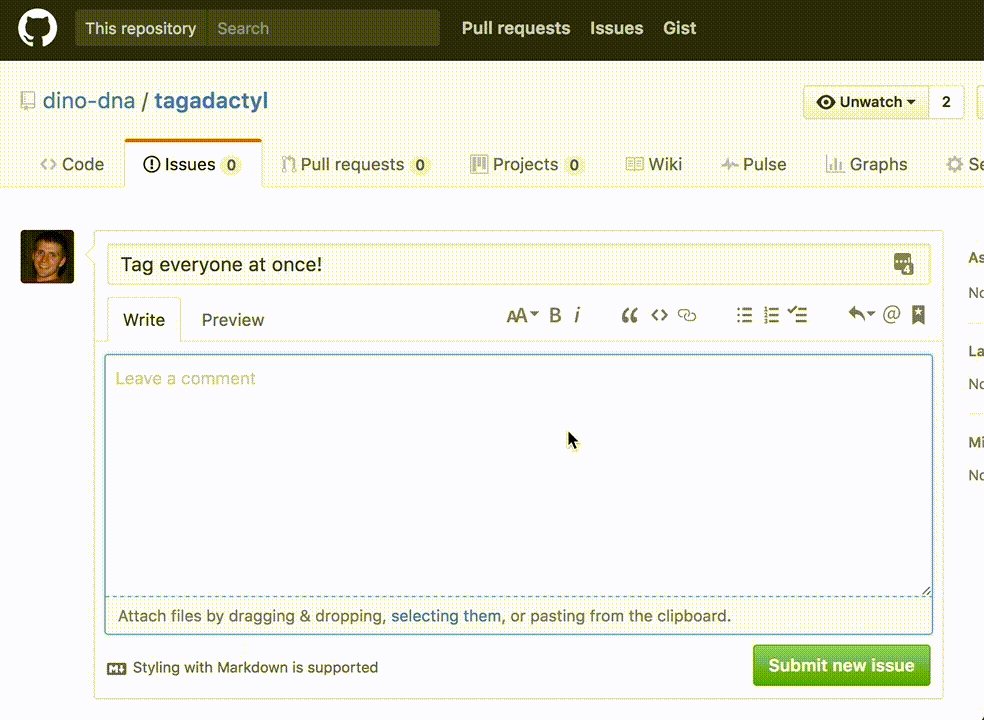

# tagadactyl

Tag project collaborators instantly in GitHub via @-mentions!

## install

- Install [from chrome, here](https://chrome.google.com/webstore/detail/tagadactyl/kefjfpalipgfihkgkdpppijlnbhoikob)

## setup

- Open the "options" screen from "Settings => Extensions => Tagadactyl"
  - Add a GitHub API key.  It's easy!  We provide step-by-step instructions in the "options" page.

## enjoy!

:)

## privacy

:lock: We do not use your data for anything other than accessing the GitHub API to _read_ project data.
